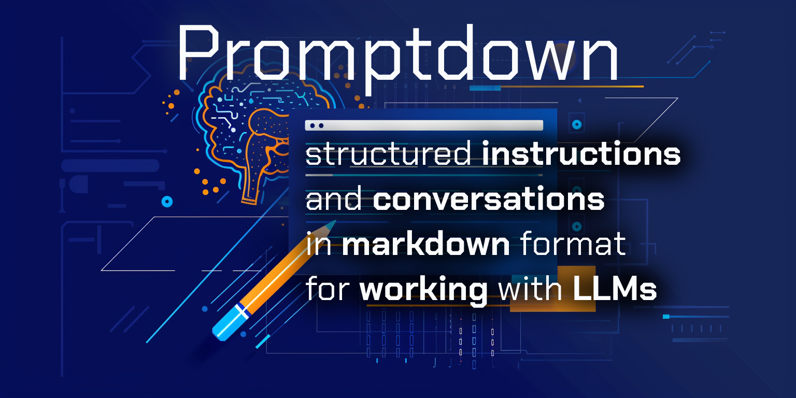

# Promptdown

Promptdown is a Python package that allows you to express structured prompts for language models in a markdown format. It provides a simple and intuitive way to define and manage prompts, making it easier to work with language models in your projects.

## Installation

### Using PDM

Promptdown can be installed using PDM:

```bash
pdm add promptdown
```

### Using pip

Alternatively, you can install Promptdown using pip:

```bash
pip install promptdown
```

## Usage

### Basic Usage

To use Promptdown, simply create a Promptdown file (`.prompt.md`) with the following format:

```markdown
# My Prompt

## System Message

You are a helpful assistant.

## Conversation

| Role      | Content                                      |
|-----------|----------------------------------------------|
| User      | Hi, can you help me?                         |
| Assistant | Of course! What do you need assistance with? |
| User      | I'm having trouble with my code.             |
| Assistant | I'd be happy to help. What seems to be the problem? |
```

Then, you can parse this file into a `StructuredPrompt` object using Promptdown:

```python
from promptdown import StructuredPrompt

structured_prompt = StructuredPrompt.from_promptdown_file('path/to/your_prompt_file.prompt.md')
print(structured_prompt)
```

**Please note** that the `Conversation` section can be omitted, but the `System Message` section is always required.

### Parsing a Prompt from a String

For scenarios where you have the prompt data as a string (perhaps dynamically generated or retrieved from an external source), you can parse it directly:

```python
from promptdown import StructuredPrompt

promptdown_string = """
# My Prompt

## System Message

You are a helpful assistant.

## Conversation

| Role      | Content                                     |
|-----------|---------------------------------------------|
| User      | Hi, can you help me?                        |
| Assistant | Of course! What do you need assistance with? |
| User      | I'm having trouble with my code.            |
| Assistant | I'd be happy to help. What seems to be the problem? |
"""

structured_prompt = StructuredPrompt.from_promptdown_string(promptdown_string)
print(structured_prompt)
```

### Simplified Conversation Format

For scenarios where you need to include multi-line messages or prefer a more readable format, Promptdown also supports a simplified conversation format. This alternative is particularly useful for writing extended dialogues or when the conversation involves complex instructions that span multiple lines.

In the simplified format, roles are marked with bold text (**Role:**), and each message can extend over multiple lines, allowing for more expressive and detailed conversations. Here's how you can structure a conversation using this format:

```markdown
# My Prompt

## System Message

You are a helpful assistant.

## Conversation

**User:**  
Hello, how are you doing today?  
I need some help with a project.

**Assistant:**  
I'm here to help. What's the issue you're encountering with your project?

**User:**  
I'm trying to integrate an API, but I keep running into errors.

**Assistant:**  
Let's go through the integration process together. Can you show me the code where you're making the API calls?
```

The simplified format is especially well-suited for complex templates where multiple template values and introductory message text need to be combined.

### Converting to Chat Completion Messages

The `to_chat_completion_messages` method converts a `StructuredPrompt` instance's conversation into a list of dictionaries suitable for chat completion API clients. This is useful when you need to send the structured conversation to an API that expects messages in a specific format. Here's an example of how to use this method:

```python
from promptdown import StructuredPrompt

promptdown_string = """
# My Prompt

## System Message

You are a helpful assistant.

## Conversation

| Role      | Content                                      |
|-----------|----------------------------------------------|
| User      | Hi, can you help me?                         |
| Assistant | Of course! What do you need assistance with? |
| User      | I'm having trouble with my code.             |
"""

structured_prompt = StructuredPrompt.from_promptdown_string(promptdown_string)
messages_from_promptdown = structured_prompt.to_chat_completion_messages()

response = client.chat.completions.create(
    model="gpt-4o",
    messages=messages_from_promptdown,
    temperature=0.7,
    max_tokens=300,
)
```

### Loading Prompts from Package Resources

For applications where prompts are bundled within Python packages, Promptdown can load prompts directly from these resources. This approach is useful for distributing prompts alongside Python libraries or applications:

```python
from promptdown import StructuredPrompt

structured_prompt = StructuredPrompt.from_package_resource('your_package', 'your_prompt_file.prompt.md')
print(structured_prompt)
```

This method facilitates easy management of prompts within a package, ensuring that they can be versioned, shared, and reused effectively.

### Using Template Strings

Promptdown supports the use of template strings within your prompts, allowing for dynamic customization of both system messages and conversation content. This feature is particularly useful when you need to tailor prompts based on specific contexts or user data.

#### Defining Template Strings

To incorporate template strings in your Promptdown files, use curly braces `{variable}` around placeholders that you intend to replace dynamically. Here is an example of how to use template strings in a prompt:

```markdown
# My Prompt

## System Message

You are a helpful assistant in {topic}.

## Conversation

| Role      | Content                                         |
|-----------|-------------------------------------------------|
| User      | Hi, can you help me with {topic}?             |
| Assistant | Of course! What specifically do you need help with in {topic}? |
| User      | I'm having trouble understanding {concept}.  |
| Assistant | No problem! Let's dive into {concept} together. |
```

#### Applying Template Values

Once you have defined a prompt with placeholders, you can replace these placeholders by passing a dictionary of template values to the `apply_template_values` method. Here's how you can apply template values to your prompt:

```python
from promptdown import StructuredPrompt

# Load your structured prompt from a file or string that contains template placeholders
structured_prompt = StructuredPrompt.from_promptdown_string(promptdown_string)

# Define the template values to apply
template_values = {
    "topic": "Python programming",
    "concept": "decorators"
}

# Apply the template values
structured_prompt.apply_template_values(template_values)

# Output the updated prompt
print(structured_prompt)
```

This will replace `{topic}` with "Python programming" and `{concept}` with "decorators" in the system message and conversation content. Using template strings in Promptdown allows for more flexible and context-sensitive interactions with language models.

## Contributing

Contributions are welcome! Feel free to open an issue or submit a pull request.

## License

Promptdown is released under the [MIT License](LICENSE).
